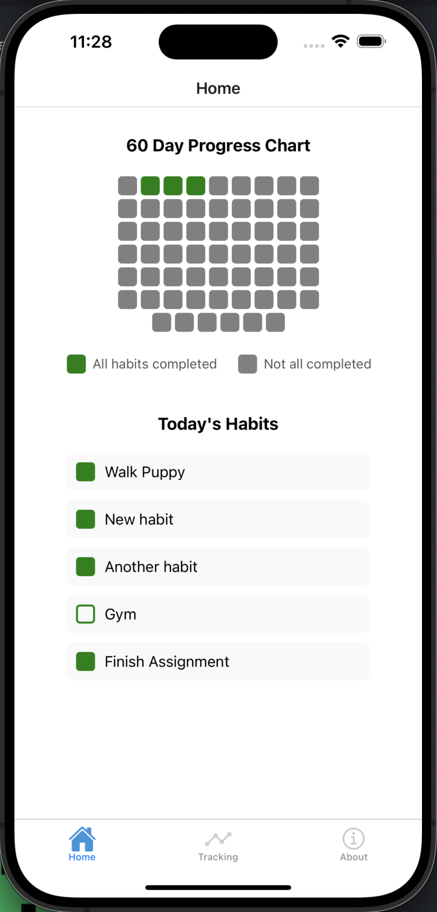

# HabitTracker

HabitTracker is a mobile application designed to help users track and improve their daily habits. With a clean and intuitive interface, the app encourages consistency by visualizing progress over a 60-day period. Users can create habits, track their completion daily, and view detailed progress in a visual grid.

## Table of Contents

- [Features](#features)
- [Demo](#demo)
- [Installation](#installation)
- [Dependencies](#dependencies)
- [Architecture](#architecture)
- [Contributing](#contributing)
- [Issue Reporting](#issue-reporting)
- [License](#license)
- [Contact](#contact)

## Features

- **Habit Management**:
  - Add, edit, and delete habits.
  - View habits dynamically based on their creation date.

- **Progress Visualization**:
  - 60-day progress grid to track daily habit completion.
  - Visual representation of days with all habits completed (green) and days with incomplete habits (gray).

- **Daily Tracking**:
  - Mark habits as completed or incomplete for specific dates.

- **User Authentication**:
  - Secure signup and login functionality.

- **About Page**:
  - Information about the app, its purpose and licensing.

## Demo



## Dependencies

- **React**: version 18.3.1
- **Vite**: For fast development server and build tool.
- **Weather API**: [weatherapi.com](https://www.weatherapi.com/) for fetching weather data.
- **GitHub API**: For fetching profile and repository information.
- **Octokit**: Github's SDK for authenitcated API requests 

## Architecture

HabitTracker is built using a modular architecture to ensure scalability, maintainability, and clear separation of concerns. Below is an overview of the application’s architecture:

### **Frontend**

The frontend is built with **React Native** and managed using **Expo**. It serves as the user interface and provides a seamless experience for tracking habits and visualizing progress.

- **Technologies Used**:
  - React Native
  - Expo

- **Key Components**:
  - **Screens**:
    - `HomeScreen`: Displays today’s habits and the 60-day progress grid.
    - `TrackingScreen`: Allows users to mark habits as completed or incomplete for specific dates.
    - `AboutScreen`: Provides details about the app.
  - **Services**:
    - `authService`: Handles authentication-related requests (signup, login, and logout).
    - `habitService`: Manages habit-related API calls such as creating, editing, and deleting habits.
    - `trackingService`: Handles progress tracking, including marking habits as completed and fetching daily progress.

### **Backend**

The backend is powered by **Express.js**, providing a RESTful API for the frontend to interact with a **MySQL database**. It handles all data-related operations, including user authentication, habit management, and progress tracking.

- **Technologies Used**:
  - Express.js
  - MySQL
  - Knex.js (for database queries)

- **Key Routes**:
  - **Authentication**:
    - `POST users/signup`: Creates a new user account.
    - `POST users/login`: Authenticates an existing user and returns a JWT token.
  - **Habits**:
    - `GET /habits`: Fetches all habits for a user.
    - `POST /habits`: Adds a new habit.
    - `PUT /habits/:id`: Updates an existing habit’s name.
    - `DELETE /habits/:id`: Deletes a habit.
  - **Tracking**:
    - `POST habit-tracking/:habitId`: Marks a habit as completed for a specific date.
    - `GET habit-tracking/:userId`: Fetches tracking data for a specific date.

- **Database Schema**:
  - **Users Table**:
    - Stores user credentials and metadata.
  - **Habits Table**:
    - Stores user-created habits with their names and creation dates.
  - **Habit_Tracking Table**:
    - Tracks daily completion status for each habit.

- **Data Flow**:
  - The frontend sends requests to the backend via custom routes.
  - The backend processes the requests using MySQL queries and responds with the necessary data or success/error messages.
  - Knex.js is used to simplify database interactions and ensure compatibility with MySQL.

## Contributing

Contributions are welcome! Please follow these steps:

1. **Fork the Repository**

2. **Create a Branch**

    ```bash
    git checkout -b your_new_branch
    ```

3. **Add, Commit and Push Your Changes**

    ```bash
    git add .
    git commit -m "Add your message here"
    git push origin your_new_branch
    ```

4. **Create a Pull Request**

- Navigate to the original repository.
- Go to 'Pull Requests', click on "New pull request" and follow the template.

## Issue Reporting

If you encounter any issues or have suggestions, please use the [GitHub Issues](https://github.com/yourusername/your-repo-name/issues) page to report them.

## License

This project is licensed under the [MIT License](LICENSE.txt).

## Contact

For any questions or suggestions, feel free to contact:

- **Email**: [andrew.debenham94@gmail.com](mailto:andrew.debenham94@gmail.com)
